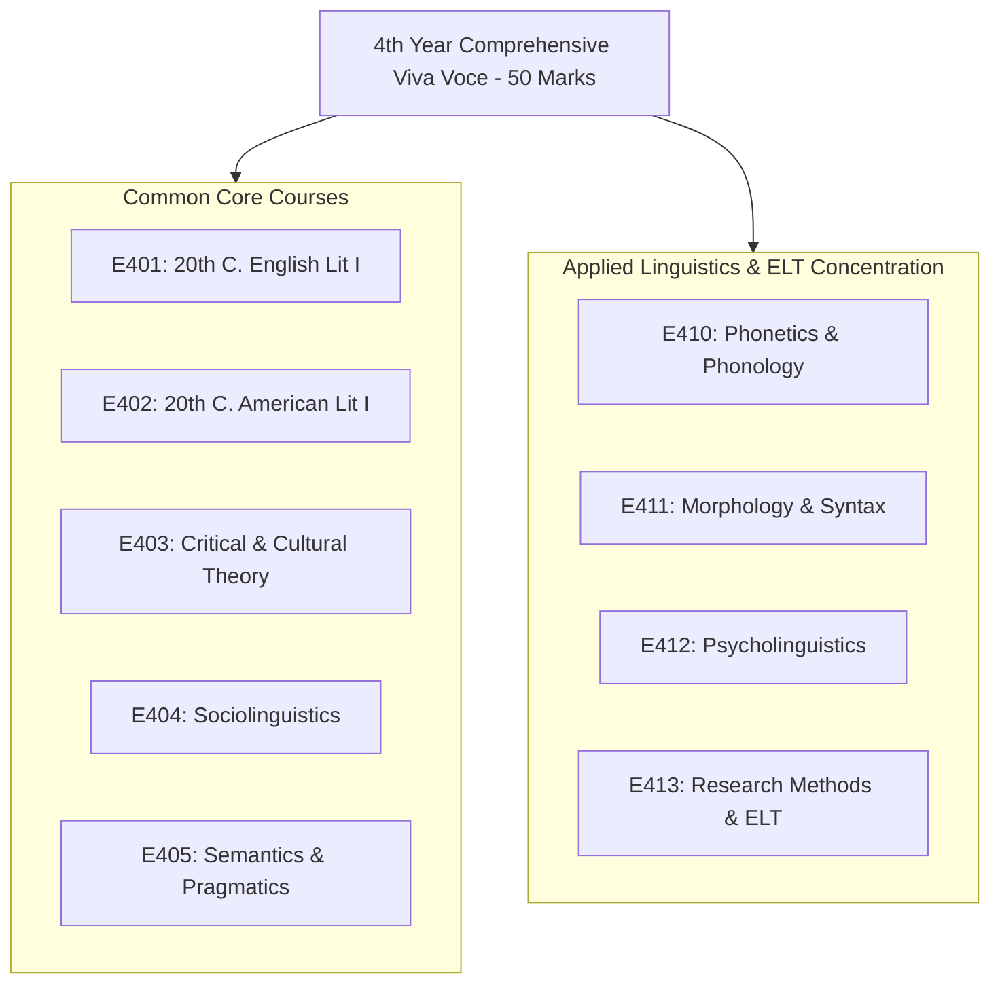

# Comprehensive Viva Voce

## 🎯 Viva Examination Architecture
The **Comprehensive Viva Voce** assesses your mastery across all **9 courses** studied throughout the 4th Year:

---

## 💡 Strategic Defense Tips

### 1. Instant Definition Precision
Deliver immediate, concise, 2-sentence definitions of key theoretical terms:
- *What is an isogloss?*
- *Differentiate between a phone, a phoneme, and an allophone.*
- *Explain Derrida's concept of différance.*
- *What is the difference between entailment and presupposition?*
- *Summarize Krashen’s Affective Filter Hypothesis.*

### 2. High-Frequency Cross-Disciplinary Questions
Board members frequently test connections between literature and linguistics:
- **Stylistics & Theory:** *"How would you analyze the dialogue in Waiting for Godot using Grice’s Cooperative Maxims?"*
- **Sociolinguistics & Literature:** *"How is dialect utilized in Pygmalion or The Bluest Eye to mark social division?"*
- **Psycholinguistics & Phonetics:** *"How do articulatory defects in Broca’s aphasia relate to consonant production?"*
